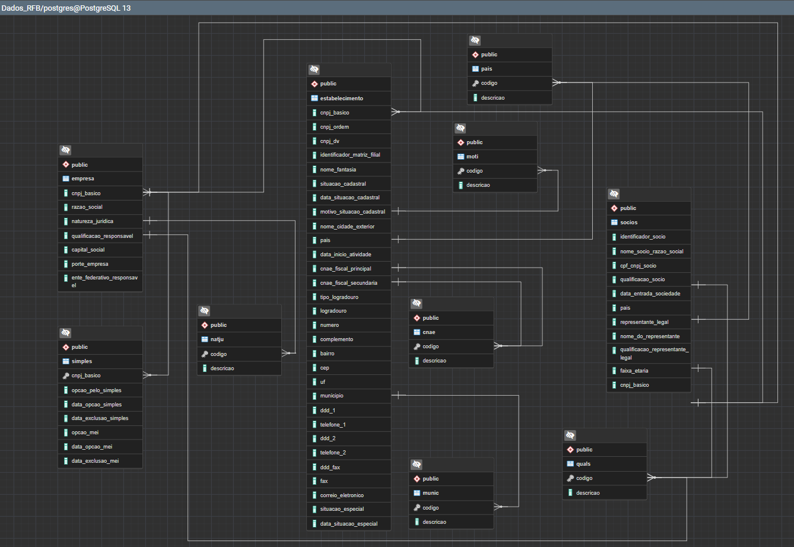

# Brazilian RFB CNPJ Database: Temporal Reconstruction & Analytics Pipeline

An enterprise-grade, relational data pipeline built on **PostgreSQL** and **Python** to ingest, parse, track, and reconstruct the historical registry states of Brazilian companies using open data releases from the Federal Revenue of Brazil (Receita Federal do Brasil - RFB).

---

### 🏛️ Project Architecture & Contributions

This repository represents the collaborative evolution of a database framework designed to transform raw administrative data dumps into a reliable longitudinal panel dataset.

### 🔹 1. Ingestion & ETL Foundation (Developed by Afonso - @aphonsoar)

- **Automated Downloader & Parser:** Scripts to download raw compressed `.zip` files from the official RFB portal, unpack them, and stream-write the records to database tables.
- **Database Schema Definition:** Production table layouts (`empresa`, `estabelecimento`, `socios`, `simples`, and auxiliary tables) and indexes optimized for `cnpj_basico`.
- **Incremental Snapshots Tracker:** A delta detection utility (`ETL_incremental_dados_RFB.py`) that compares monthly staging tables against production baselines, logging changes (`INSERT`, `UPDATE`, `DELETE`) into a centralized `public.snapshots` event ledger.

### 🔸 2. Temporal Reconstruction & Analytical Framework (Developed by @rtjaiany)

- **Schema `analytics` Layout:** A sandboxed analytical schema created to support reproducible panel generation for temporal and business intelligence research without modifying the core production tables.
- **Procedure `analytics.reconstruct_panel()`:** A forward-chronological batch engine that initializes a baseline state (e.g., `2023-05`), applies the monthly delta updates from `snapshots` sequentially, and builds a comprehensive, unified establishment-level panel.
- **Null Minimization Deduplication:** Implementation of a CTE-based window function that scores duplicate staging records by completeness (fewer null values) during ingestion, ensuring constraint integrity without information loss.
- **Parquet Streaming Pipeline:** An optimized PyArrow script that streams the reconstructed panel from PostgreSQL and writes it chunk-by-chunk to Snappy compressed partitioned Parquet files for high-speed downstream analytics.
- **Technical Manifest & PDF Compiler:** A document detailing the entire data dictionary, coverage statistics, and reconciliation counts (`complete_data_manifest.md`), with an automated PDF generation utility.

---

## 📂 Repository Structure

```
├── code/
│   ├── ETL_coletar_dados_e_gravar_BD.py  # Ingests full RFB dumps [Afonso]
│   ├── ETL_incremental_dados_RFB.py     # Incremental snapshot logger with deduplication [Afonso]
│   ├── banco_de_dados.sql               # Production schema definition [Afonso]
│   ├── snapshots.sql                    # Snapshot tables and logs setup [Afonso]
│   ├── test_incremental.py              # Incremental parsing test framework [Afonso]
│   ├── reconstruct_panel.sql            # Forward longitudinal reconstruction query [rtjaiany]
│   ├── export_panel_parquet.py          # Streams panel data to Snappy partitioned Parquet [rtjaiany]
│   ├── convert_to_pdf.py                # Compiles markdown reports to formatted PDF [rtjaiany]
│   └── .env_template                    # Environment variables template
├── old/                                 # Legacy scripts and SQL queries
│   ├── ETL_incremental_dados_RFB.py     # Pre-deduplication incremental ETL script
│   ├── export_csv.py                    # Obsolete CSV export script
│   ├── reconstruct_analytics.sql        # Legacy analytical reconstruction procedure
│   └── run_range_updates.py             # Obsolete range update script
├── docs/                                # Diagrams and layout guides
│   ├── Dados_RFB_ERD.png                # Entity-Relationship Diagram
│   ├── ERD_Dados_RFB.pgerd              # PostgreSQL ERD layout source
│   └── NOVOLAYOUTDOSDADOSABERTOSDOCNPJ.pdf # Official RFB file layout guide
├── complete_data_manifest.md            # Comprehensive project manifest, dictionary, and lineage report
├── requirements.txt                     # Python dependency list
└── README.md                            # Project documentation
```

---

## 🚀 Getting Started

### Prerequisites

- Python 3.8+
- PostgreSQL 14.2+ (with `pgcrypto` extension for hashing)

### 1. Database Setup & Ingestion (Afonso's Layer)

1. Initialize the PostgreSQL schema:
    ```bash
    psql -h localhost -U postgres -d cnpj -f code/banco_de_dados.sql
    ```
2. Set up environment variables in `code/.env` matching the template:
    ```env
    DB_HOST=localhost
    DB_PORT=5432
    DB_USER=postgres
    DB_PASSWORD=your_password
    DB_NAME=cnpj
    OUTPUT_FILES_PATH=/path/to/downloads
    EXTRACTED_FILES_PATH=/path/to/extracted
    ```
3. Install dependencies and run the core ETL:
    ```bash
    pip install -r requirements.txt
    python code/ETL_coletar_dados_e_gravar_BD.py
    ```

### 2. Historical Reconstruction & Analytics (rtjaiany's Layer)

1. Compile the analytical reconstruction procedure:
    ```bash
    psql -h localhost -U postgres -d cnpj -f code/reconstruct_panel.sql
    ```
2. Execute the forward temporal reconstruction process (e.g., from May 2023 to July 2023 for São Paulo):
    ```bash
    psql -h localhost -U postgres -d cnpj -c "CALL analytics.reconstruct_panel('2023-05', '2023-07', 'SP');"
    ```
    _This procedure will automatically initialize the baseline state, sort records using null minimization criteria, process the incremental deltas, and log the longitudinal sequence in `analytics.establishment_panel`._
3. Export the final panel to Snappy compressed partitioned Parquet files:
    ```bash
    python code/export_panel_parquet.py
    ```
    _This streams the reconstructed rows into the `/reconstructed_panel/` directory, saving disk space and optimizing downstream query engines._
4. (Optional) Generate the PDF version of the technical manifest:
    ```bash
    python code/convert_to_pdf.py
    ```

---

## 📊 Reconstructed Analytics Schema Dictionary

Our reconstruction process compiles the temporal sequences into a single consolidated table in the `analytics` schema:

1. `analytics.establishment_panel`: Historical, unified month-by-month longitudinal registry table containing complete establishment characteristics, company details, Simples/MEI status, and socio-partner summary counts.

For a full description of the columns, data types, and null coverage metrics, please refer to the `complete_data_manifest.md`.

---

## 🔐 Privacy & Anonymization

To protect personally identifiable information (PII) of business owners and representatives, the analytics procedure processes all names, CPFs, and representative identifiers using PG's crypto extensions:

`hashed_field = SHA256(UTF-8(value))`

This preserves relationships and entity linkages across months while ensuring complete privacy and anonymization.

---

## 📈 Entity-Relationship Diagram

Refer to the database entity relationships depicted below:


