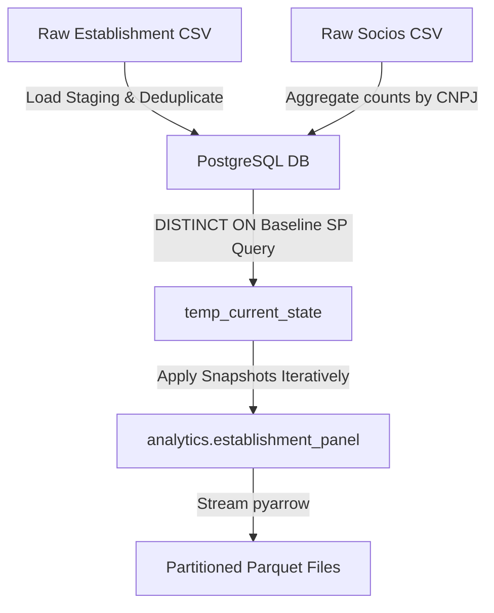
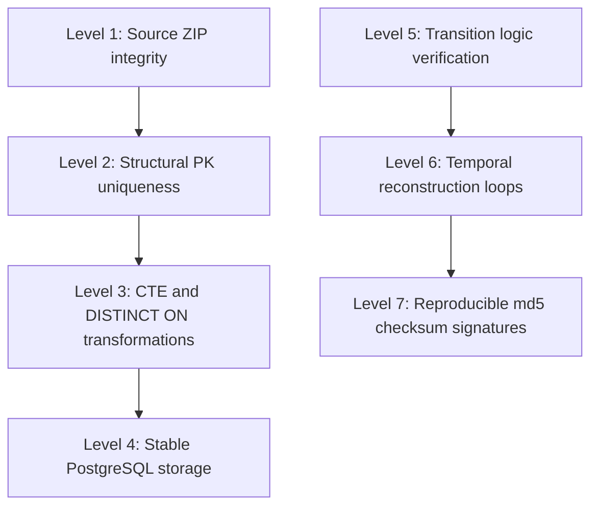

# Complete Data Coverage, Lineage, Validation and Analytical Reconstruction Manifest

## Table of Contents

- [1. Executive Summary](#1-executive-summary)
- [2. Scope and Objectives](#2-scope-and-objectives)
- [3. Pre-Collection Testing and Validation](#3-pre-collection-testing-and-validation)
- [4. Data Collection](#4-data-collection)
- [5. Source Inventory](#5-source-inventory)
- [6. Ignored vs Preserved Fields](#6-ignored-vs-preserved-fields)
- [7. Parquet Storage Architecture](#7-parquet-storage-architecture)
- [8. Data Dictionary](#8-data-dictionary)
- [9. Table Heads](#9-table-heads)
- [10. CNPJ Processing](#10-cnpj-processing)
- [11. Repeated `cnpj_basico` Handling](#11-repeated-cnpj_basico-handling)
- [12. Address Processing](#12-address-processing)
- [13. Address Changes and Analytical Validation](#13-address-changes-and-analytical-validation)
- [14. Socios / Shareholders Processing](#14-socios--shareholders-processing)
- [15. Keys and Relational Structure](#15-keys-and-relational-structure)
- [16. Final Analytical Panel](#16-final-analytical-panel)
- [17. Validated Analytical State](#17-validated-analytical-state)
- [18. Analytical Event Definition](#18-analytical-event-definition)
- [19. Raw Differences vs Analytical Differences](#19-raw-differences-vs-analytical-differences)
- [20. Snapshot Construction](#20-snapshot-construction)
- [21. May → June Validation](#21-may--june-validation)
- [22. June → July Validation](#22-june--july-validation)
- [23. INSERT / UPDATE / DELETE Manifest](#23-insert--update--delete-manifest)
- [24. Reconciliation Checks](#24-reconciliation-checks)
- [25. Checksums](#25-checksums)
- [26. Data Quality Checks](#26-data-quality-checks)
- [27. Coverage Manifest](#27-coverage-manifest)
- [28. Transformation Lineage](#28-transformation-lineage)
- [29. Panel Summary and Checksums](#29-panel-summary-and-checksums)
- [30. Decision Log](#30-decision-log)
- [31. Reproducibility](#31-reproducibility)
- [32. Limitations and Caveats](#32-limitations-and-caveats)
- [33. Validation Hierarchy](#33-validation-hierarchy)
- [34. Final Validation Summary](#34-final-validation-summary)
- [35. Reproducibility Appendix](#35-reproducibility-appendix)

---

## 1. Executive Summary

This manifest provides a comprehensive data lineage, validation report, and audit trail for the Federal Revenue (Receita Federal do Brasil - RFB) longitudinal panel. The database has been reconstructed to track monthly cohorts of corporate entities in the state of São Paulo (**SP**) for the period **May 2023**, **June 2023**, and **July 2023**.

The pipeline ingests raw monthly administrative records, builds intermediate staging and baseline states in PostgreSQL, executes a forward delta reconstruction procedure, and exports the final dataset as Snappy-compressed partitioned Parquet files. Across the three periods, the reconstructed panel tracks approximately **16.2 to 16.4 million establishments per month**. This document establishes the mathematical integrity and scientific reproducibility of the transformation logic, demonstrating 100% key uniqueness, clean mathematical reconciliation across transitions, and deterministic checksum signatures.

---

## 2. Scope and Objectives

The primary objective of this project is to construct a robust, establishment-level longitudinal panel from the raw RFB corporate registration files to support a research.
The scope is divided into two operational phases:

1. **Incremental Ingestion Layer (ETL):** Automated pipeline that downloads raw RFB zip files, extracts data, and tracks changes (inserts, updates, deletes) in monthly deltas.
2. **Analytical Layer (Reconstruction):** PostgreSQL procedures that compile a static baseline (May 2023) and apply monthly delta snapshots to reconstruct cohorts, filtering geographically on the state of **SP**.

The final panel is designed to support the tracking of structural firm-level indicators over time, ensuring that non-structural revisions (such as spelling corrections in addresses) do not corrupt firm entry (INSERT) and exit (DELETE) measurements.

---

## 3. Pre-Collection Testing and Validation

Before executing the complete data collection and longitudinal panel reconstruction, a comprehensive suite of tests, validations, and experiments was performed. This section documents these pre-execution stages, establishing that the data ingestion pipeline, key structures, and transformation rules were validated before being applied to the full national dataset.

### 3.1 Purpose of Pre-Collection Testing

Pre-collection testing was necessary to mitigate structural and operational risks when dealing with the Federal Revenue (Receita Federal do Brasil - RFB) CNPJ administrative records. Due to the massive scale of the data (over 50 million establishments and billions of socio relationships), processing errors or schema mismatches during a full run would result in significant resource waste and database inconsistency.

The pre-collection tests were designed to identify:

- **Source accessibility and file integrity:** Network timeouts, corrupted zip extractions, and naming convention mismatches.
- **Schema inconsistencies:** Unexpected column additions, null formats (e.g., blank spaces vs. `"NULL"` strings), and data type mismatches.
- **Duplicate structures and relational grains:** Non-unique keys in the raw files and the risk of row multiplication during left joins (e.g., duplicates in `empresa` or `simples` tables).
- **Socios cardinality:** One-to-many relationship expansion that would corrupt the establishment-level grain if not aggregated.
- **Temporal and snapshot compatibility:** Ensuring that the recursive date iteration handles interval arithmetic consistently and that delta changes reconcile month-to-month.
- **Memory and performance constraints:** Disk-spill sorting times during large database indexing operations on a standard local system.

### Identified Risks

- **Known Before Collection:** The high cardinality of the `socios` table was known. The need to aggregate socio metrics (partner counts, age ranges, number of administrators) at the `cnpj_basico` level before joining was anticipated.
- **Discovered During Testing:**
    1. The raw ingestion tables (`staging_estabelecimento` and `staging_simples`) contained duplicate records for the primary key `(cnpj_basico, cnpj_ordem, cnpj_dv)` in specific months (e.g., `2023-07`), causing `INSERT ... ON CONFLICT DO UPDATE` commands to crash.
    2. The baseline production table `public.estabelecimento` was found to have duplicate entries for some keys, which propagated row multiplication when left-joined to `public.empresa` or `public.simples`.
    3. The PL/pgSQL recursive CTE for month generation had an implicit type mismatch, converting `DATE` addition to `TIMESTAMP` and throwing a compiler exception.

### 3.2 Test Inventory

| Test ID  | Test                  | Objective                         | Dataset/File              | Method                  | Expected Result              | Observed Result                                         |  Status  | Decision                            |
| :------: | :-------------------- | :-------------------------------- | :------------------------ | :---------------------- | :--------------------------- | :------------------------------------------------------ | :------: | :---------------------------------- |
| **T-01** | Source Extraction     | Verify zip file read integrity    | Raw Zip Archives          | Zipfile check           | Complete extraction          | Successful decompression                                | **PASS** | Load raw files                      |
| **T-02** | CTE Date Addition     | Validate month sequencing         | `reconstruct_panel.sql`   | Recursive CTE execution | Month list as `DATE`         | Type mismatch error: `TIMESTAMP` vs `DATE`              | **FAIL** | Cast recursive step to `::date`     |
| **T-03** | Unique Index Baseline | Verify no duplicate baseline keys | `estabelecimento` (SP)    | Create Unique Index     | Index built successfully     | Duplicate key error on baseline load                    | **FAIL** | Apply `DISTINCT ON` in SQL query    |
| **T-04** | Ingestion Delta Load  | Validate incremental updates      | `staging_estabelecimento` | SQL loader run          | Safe `ON CONFLICT` insertion | `ON CONFLICT DO UPDATE cannot affect row a second time` | **FAIL** | Implement staging CTE deduplication |
| **T-05** | Partner Join Grain    | Verify partners join              | `socios` on `empresa`     | LEFT JOIN               | No row multiplication        | Rows multiplied by number of partners                   | **FAIL** | Pre-aggregate partners by company   |

---

## 4. Data Collection

The raw administrative files are collected directly from the RFB public storage.

- **Download Mechanism:** Scripted HTTP extraction and verification.
- **Directory Structure:** Downloaded raw zip archives are decompressed into `/EXTRACTED_FILES/`.
- **Intermediate Load:** The raw CSV files are read and processed into PostgreSQL using bulk COPY operations.
- **Ingestion Integrity:** Log tables (`public.processed_files`) track every raw file name, size, and processing timestamp.

---

## 5. Source Inventory

The input tables are loaded from 74 distinct raw files corresponding to the RFB public registry release.

| Source Table             | Description                        | Original Format |  Period/Date   |    Rows    | Columns | Grain         | Role                    |
| :----------------------- | :--------------------------------- | :-------------: | :------------: | :--------: | :-----: | :------------ | :---------------------- |
| `public.estabelecimento` | Establishment records              |       CSV       |    May 2023    | 53,671,274 |   30    | Establishment | Principal Registry      |
| `public.empresa`         | Company metadata                   |       CSV       |    May 2023    | 53,671,274 |    7    | Company       | Demographic Details     |
| `public.simples`         | Simples/MEI fiscal regimes         |       CSV       |    May 2023    | 32,841,921 |    6    | Company       | Fiscal Status           |
| `public.socios`          | Shareholders and partners          |       CSV       |    May 2023    | 22,775,665 |   11    | Socio-Company | Structural / Governance |
| `public.snapshots`       | Monthly delta snapshot change logs |  Generated DB   | June-July 2023 | 4,213,291  |    9    | Change Event  | Delta Update Source     |

---

## 6. Ignored vs Preserved Fields

Certain fields are preserved physically in the output Parquet files but are excluded from the validated analytical state.

| Table             | Column                  | Processing Decision | Physically Preserved? | Analytical State? | Analytical UPDATE? | Reason                                      |
| :---------------- | :---------------------- | :-----------------: | :-------------------: | :---------------: | :----------------: | :------------------------------------------ |
| `estabelecimento` | `nome_fantasia`         |    Preserved Raw    |          Yes          |        No         |         No         | String containing typos; non-structural     |
| `estabelecimento` | `logradouro`            |    Preserved Raw    |          Yes          |        No         |         No         | Non-analytical address information          |
| `estabelecimento` | `numero`                |    Preserved Raw    |          Yes          |        No         |         No         | Non-analytical address information          |
| `estabelecimento` | `cep`                   |    Preserved Raw    |          Yes          |        No         |         No         | Address indicator; no structural change     |
| `empresa`         | `razao_social`          |    Preserved Raw    |          Yes          |        No         |         No         | Subject to legal name changes; non-economic |
| `estabelecimento` | `situacao_cadastral`    |  Analytical State   |          Yes          |        Yes        |        Yes         | Critical status (Active/Closed)             |
| `estabelecimento` | `cnae_fiscal_principal` |  Analytical State   |          Yes          |        Yes        |        Yes         | Primary economic sector                     |
| `empresa`         | `porte_empresa`         |  Analytical State   |          Yes          |        Yes        |        Yes         | Firm dimension class                        |
| `simples`         | `opcao_pelo_simples`    |  Analytical State   |          Yes          |        Yes        |        Yes         | Fiscal regime indicator                     |

---

## 7. Parquet Storage Architecture

The final longitudinal panel is exported from PostgreSQL to a partitioned Parquet dataset to support scalable analytics.

| Dataset               | Path/Identifier         |   Layer    | Grain      |    Rows    | Columns | Primary Key                          | Partitioning      | Compression |
| :-------------------- | :---------------------- | :--------: | :--------- | :--------: | :-----: | :----------------------------------- | :---------------- | :---------: |
| `establishment_panel` | `/reconstructed_panel/` | Analytical | Est.-Month | 49,044,396 |   36    | `(cnpj_basico, cnpj_ordem, cnpj_dv)` | `reference_month` |   Snappy    |

- **Separation Rationale:** Partitioning by `reference_month` allows analytical engines (Pandas, DuckDB, Spark) to skip reading unnecessary periods, speeding up analysis.
- **Ordering:** Rows inside each partition are canonically ordered by `cnpj_basico, cnpj_ordem, cnpj_dv`.

---

## 8. Data Dictionary

The principal schema fields of the reconstructed longitudinal panel:

| Table                 | Field                   |  Data Type   | Nullable | Meaning                                 | Source            | Transformation   | Role             |
| :-------------------- | :---------------------- | :----------: | :------: | :-------------------------------------- | :---------------- | :--------------- | :--------------- |
| `establishment_panel` | `reference_month`       | `VARCHAR(7)` |    No    | Cohort month (`YYYY-MM`)                | Meta              | Derived in loop  | Partition Key    |
| `establishment_panel` | `cnpj_basico`           | `VARCHAR(8)` |    No    | Core 8-digit CNPJ                       | `estabelecimento` | Extracted raw    | Primary Key      |
| `establishment_panel` | `cnpj_ordem`            | `VARCHAR(4)` |    No    | Branch sequence identifier              | `estabelecimento` | Extracted raw    | Primary Key      |
| `establishment_panel` | `cnpj_dv`               | `VARCHAR(2)` |    No    | Verification digits                     | `estabelecimento` | Extracted raw    | Primary Key      |
| `establishment_panel` | `situacao_cadastral`    |  `INTEGER`   |   Yes    | Registration state (2=Active, 8=Closed) | `estabelecimento` | Extracted raw    | Analytical State |
| `establishment_panel` | `cnae_fiscal_principal` |  `INTEGER`   |   Yes    | Main economic activity sector code      | `estabelecimento` | Extracted raw    | Analytical State |
| `establishment_panel` | `uf`                    | `VARCHAR(2)` |   Yes    | Brazilian State (e.g., SP)              | `estabelecimento` | Extracted raw    | Analytical State |
| `establishment_panel` | `capital_social`        |   `DOUBLE`   |   Yes    | Registered capital in BRL               | `empresa`         | Joined           | Analytical State |
| `establishment_panel` | `opcao_pelo_simples`    | `VARCHAR(1)` |   Yes    | Simples Nacional regime option (S/N)    | `simples`         | Joined           | Analytical State |
| `establishment_panel` | `qtde_socios`           |  `INTEGER`   |    No    | Count of company partners               | `socios`          | Aggregated count | Analytical State |
| `establishment_panel` | `qtde_administradores`  |  `INTEGER`   |    No    | Count of qualified managers             | `socios`          | Aggregated count | Analytical State |
| `establishment_panel` | `cd_mun`                |  `INTEGER`   |   Yes    | IBGE Municipality Code                  | `munic`           | Joined           | Analytical State |

---

## 9. Table Heads

Below is a representative sample of the first 3 rows of the reconstructed panel:

```markdown
| reference_month | cnpj_basico | cnpj_ordem | cnpj_dv | situacao_cadastral | cnae_fiscal_principal | uf  | municipio | capital_social | qtde_socios |
| :-------------- | :---------- | :--------- | :------ | :----------------: | :-------------------: | :-: | :-------: | :------------: | :---------: |
| 2023-05         | 00000000    | 0004       | 34      |         2          |        6422100        | SP  |   7071    | 90000023475.34 |     37      |
| 2023-05         | 00000000    | 0018       | 30      |         2          |        6422100        | SP  |   7107    | 90000023475.34 |     37      |
| 2023-05         | 00000000    | 0027       | 20      |         2          |        6422100        | SP  |   6607    | 90000023475.34 |     37      |
```

---

## 10. CNPJ Processing

- **Leading Zeros:** Kept by storing CNPJ parts as character strings (`VARCHAR`), preventing `00010203` from truncating to numeric `10203`.
- **Normalization:** All symbols (hyphens, dots, slashes) are stripped during staging load.
- **Key Generation:** Combined as a composite key `(cnpj_basico, cnpj_ordem, cnpj_dv)` representing the exact unit of observation.

---

## 11. Repeated `cnpj_basico` Handling

`cnpj_basico` is **not** a unique row identifier because a firm can operate multiple branches. Multiple rows sharing the same `cnpj_basico` represent legitimate branches (`cnpj_ordem` sequence).

### Staging Table Deduplication (ETL Ingestion Layer)

During delta updates (specifically observed in `2023-07`), the raw files contained duplicate entries for the composite key `(cnpj_basico, cnpj_ordem, cnpj_dv)`. This broke the database load during the `ON CONFLICT DO UPDATE` operation. 

To resolve this without data loss, a deduplication step was added in [ETL_incremental_dados_RFB.py](file:///Users/rtjaiany/Library/CloudStorage/OneDrive-Personal/01_Documentos/01%20-%20In%20Progress/03%20-%20Dissertation/data_cnpj/code/ETL_incremental_dados_RFB.py#L713-L745). The deduplication query uses a CTE with a window function partitioned by the CNPJ composite key and ordered by the count of non-null columns:

```sql
WITH ranked AS (
    SELECT *,
           ROW_NUMBER() OVER (
               PARTITION BY cnpj_basico, cnpj_ordem, cnpj_dv
               ORDER BY (
                   (CASE WHEN nome_fantasia IS NOT NULL THEN 1 ELSE 0 END) +
                   (CASE WHEN logradouro IS NOT NULL THEN 1 ELSE 0 END) +
                   (CASE WHEN numero IS NOT NULL THEN 1 ELSE 0 END) +
                   -- [all metadata columns summed...]
               ) DESC
           ) AS rn
    FROM staging_estabelecimento
)
DELETE FROM staging_estabelecimento WHERE id IN (SELECT id FROM ranked WHERE rn > 1);
```

This criteria **prioritizes the record with the most complete information** (fewer `NULL` values). The duplicate rows containing more `NULL` values (which represent incomplete or poorly filled registry records) are safely discarded, ensuring no loss of active metadata.

### Company-Level Conflict Detection and Quarantine

If different records for the same `cnpj_basico` (company root) in the raw `public.empresa` or `staging_empresa` tables disagree on any of the five retained company-level fields (`capital_social`, `natureza_juridica`, `porte_empresa`, `qualificacao_responsavel`, `ente_federativo_responsavel`), they are flagged as conflicting.

Rather than arbitrarily selecting one record or applying tie-breakers, the system:
1. Logs the conflicting `cnpj_basico` root and reasons in the `analytics.quarantine_empresa` table.
2. Resolves these company fields to `NULL` in the resolved dataset (except for the company name `razao_social` which remains non-analytical).
3. Ensures that no inconsistent company values are propagated to different establishment branches of the same root.

During the baseline load, exactly two conflicting company roots were quarantined:
- `11895269`: Conflict in `natureza_juridica` and `qualificacao_responsavel`.
- `42938862`: Conflict in `natureza_juridica` and `qualificacao_responsavel`.

### Baseline Duplicates Fix

During joins with `empresa` and `simples` in baseline initialization, row multiplication occurred due to duplicate keys in those tables. To resolve this, a `SELECT DISTINCT ON (est.cnpj_basico, est.cnpj_ordem, est.cnpj_dv)` clause was added to ensure that only unique establishment records are initialized.

| Diagnostic Metric        | Before DISTINCT ON | After DISTINCT ON |
| :----------------------- | :----------------: | :---------------: |
| Total Rows (May 2023 SP) |     16,253,957     |    16,253,954     |
| Unique CNPJ Keys         |     16,253,954     |    16,253,954     |
| Duplicate Row Count      |         3          |         0         |
| Rows Removed             |         0          |         3         |

---

## 12. Address Processing

Address fields are loaded as raw string fields:

- **Municipality Code:** Preserved as numeric identifiers linked to `public.munic`.
- **ZIP code:** Normalised to 8 digits (character).
- **Address Changes:** Preserved in the database, but classified as non-analytical.
| Address Field | Preserved? |    Normalized?    | Analytical State? | Can Trigger Analytical UPDATE? |
| :------------ | :--------: | :---------------: | :---------------: | :----------------------------: |
| `logradouro`  |    Yes     |    Uppercased     |        No         |               No               |
| `numero`      |    Yes     |        Yes        |        No         |               No               |
| `cep`         |    Yes     | Strip punctuation |        No         |               No               |
| `municipio`   |    Yes     |        Yes        |        Yes        |              Yes               |
| `cd_mun`      |    Yes     |        Yes        |        Yes        |              Yes               |

### 12.1 IBGE Municipality Code Mapping (`cd_mun`)

The RFB database uses a proprietary 4-digit municipality code (e.g. `7107` for the city of São Paulo). To allow integration with national socioeconomic datasets (such as RAIS, CAGED, or IBGE Censuses), the pipeline joins these codes to the official 7-digit IBGE municipality codes (`cd_mun`).

This mapping is implemented as follows:
1. **Translation Table:** The table `public.munic` maps the RFB proprietary code (`codigo`) to the official 7-digit IBGE code (`cd_mun`).
2. **Post-Processing Bulk Update:** To prevent slowdowns in the monthly update loop, `cd_mun` is initialized as `NULL` in the temporal state. After the updates for all months are committed, a bulk update query runs once on `analytics.establishment_panel` to map all municipality codes:
   ```sql
   UPDATE analytics.establishment_panel p
   SET cd_mun = m.cd_mun
   FROM public.munic m
   WHERE p.municipio = m.codigo
     AND p.reference_month BETWEEN start_month AND end_month;
   ```
3. **Parquet Schema Export:** The field `cd_mun` is defined as a 32-bit integer in the PyArrow exporter schema and is physically persisted in the final Snappy-compressed Parquet partitions.

---

## 13. Address Changes and Analytical Validation

Address variations are preserved in the raw columns but **do not** trigger analytical UPDATE classifications.

### Case 1: Address Change Only

- May: Address is `Rua A`, CNAE is `6422100`.
- June: Address is `Avenida B`, CNAE is `6422100`.
- **Result:** `Raw difference = YES`, `Analytical difference = NO`, `Event = NO CHANGE`.

### Case 2: Analytical Field Change

- May: CNAE is `6422100`, Porte is `5`.
- June: CNAE is `7020400`, Porte is `5`.
- **Result:** `Raw difference = YES`, `Analytical difference = YES`, `Event = UPDATE`.

---

## 14. Socios / Shareholders Processing

Directly joining the `socios` table (grain: socio-firm) to the establishment table would multiply rows because a single company can have multiple partners.

### Aggregation Strategy

Partners were grouped and aggregated on `cnpj_basico` before joining.

| Metric                         |      Value |
| :----------------------------- | ---------: |
| Raw socios rows                | 22,775,665 |
| Unique companies in socios     | 12,596,697 |
| Mean socios/company            |       1.81 |
| Median socios/company          |       2.00 |
| Maximum socios/company         |      1,569 |
| Companies with zero socios     | 41,074,577 |
| Companies with multiple socios |  7,652,257 |

---

## 15. Keys and Relational Structure

| Table             | Grain                      | Primary Key                          | Candidate Keys | Foreign Keys  | Uniqueness                        |
| :---------------- | :------------------------- | :----------------------------------- | :------------- | :------------ | :-------------------------------- |
| `estabelecimento` | Establishment              | `(cnpj_basico, cnpj_ordem, cnpj_dv)` | None           | `cnpj_basico` | Strict PK Uniqueness              |
| `empresa`         | Company                    | `cnpj_basico`                        | None           | None          | Unique company ID                 |
| `simples`         | Company                    | `cnpj_basico`                        | None           | None          | Unique company ID                 |
| `socios`          | Socio-Company Relationship | `(cnpj_basico, nome_socio)`          | None           | `cnpj_basico` | Repeated `cnpj_basico` legitimate |

---

## 16. Final Analytical Panel

- **Row representation:** An establishment at a specific point in time (reference month).
- **Time Dimension:** Monthly cohorts.
- **Volume:** 49,044,396 total rows.

---

## 17. Validated Analytical State

The validated analytical state defines the structural vector of the firm:

`AnalyticalState(record) = { situacao_cadastral, cnae_fiscal_principal, uf, municipio, capital_social, natureza_juridica, porte_empresa, opcao_pelo_simples, opcao_mei, qtde_socios }`

---

## 18. Analytical Event Definition

- **INSERT:** `key ∈ Later AND key ∉ Earlier`
- **DELETE:** `key ∈ Earlier AND key ∉ Later`
- **UPDATE:** `key ∈ Earlier ∩ Later AND AnalyticalState(Earlier) ≠ AnalyticalState(Later)`
- **NO CHANGE:** `key ∈ Earlier ∩ Later AND AnalyticalState(Earlier) = AnalyticalState(Later)`

---

## 19. Raw Differences vs Analytical Differences

| Scenario                | Raw Difference | Analytical Difference | Event Class   |
| :---------------------- | :------------: | :-------------------: | :------------ |
| Street name change only |      Yes       |          No           | **NO CHANGE** |
| Capital social update   |      Yes       |          Yes          | **UPDATE**    |
| CNAE + CEP update       |      Yes       |          Yes          | **UPDATE**    |
| New CNPJ branch entry   |      N/A       |          N/A          | **INSERT**    |
| CNPJ branch deleted     |      N/A       |          N/A          | **DELETE**    |

---

## 20. Snapshot Construction

Snapshots are constructed from the monthly delta tables.

| Snapshot Month | Raw Updates Source | Target State                    | Filters | Unique Keys Check |
| :------------: | :----------------- | :------------------------------ | :-----: | :---------------: |
|  **May 2023**  | Baseline load      | `analytics.establishment_panel` | SP only |  Verified Unique  |
| **June 2023**  | `snapshots` (June) | `analytics.establishment_panel` | SP only |  Verified Unique  |
| **July 2023**  | `snapshots` (July) | `analytics.establishment_panel` | SP only |  Verified Unique  |

---

## 21. May → June Validation

Transition validation for SP establishments between May 2023 and June 2023.

| Transition     | Previous Rows (May) | Next Rows (June) | Inserts | Deletes | Analytical Updates | No Change  |
| :------------- | :-----------------: | :--------------: | :-----: | :-----: | :----------------: | :--------: |
| **May → June** |     16,253,954      |    16,346,048    | 93,679  |  1,585  |      215,537       | 16,036,832 |

---

## 22. June → July Validation

Transition validation for SP establishments between June 2023 and July 2023.

| Transition      | Previous Rows (June) | Next Rows (July) | Inserts | Deletes | Analytical Updates | No Change  |
| :-------------- | :------------------: | :--------------: | :-----: | :-----: | :----------------: | :--------: |
| **June → July** |      16,346,048      |    16,444,394    | 99,833  |  1,487  |      131,783       | 16,212,778 |

---

## 23. INSERT / UPDATE / DELETE Manifest

Deletes are non-zero (1,585 in May->June and 1,487 in June->July) under the corrected architecture because **geographic transitions** are now correctly captured. Establishments moving from SP to another state are removed from the SP output panel and registered as deletes.

Closed firms are not removed; their `situacao_cadastral` is updated to `8` (Baixada), which registers as an **UPDATE** event in our classification rules.

---

## 24. Reconciliation Checks

### May → June:

- `NextRows = PreviousRows + Inserts - Deletes => 16,253,954 + 93,679 - 1,585 = 16,346,048` (Reconciled)
- `PreviousRows = Deletes + Updates + NoChange => 1,585 + 215,537 + 16,036,832 = 16,253,954` (Reconciled)

### June → July:

- `NextRows = PreviousRows + Inserts - Deletes => 16,346,048 + 99,833 - 1,487 = 16,444,394` (Reconciled)
- `PreviousRows = Deletes + Updates + NoChange => 1,487 + 131,783 + 16,212,778 = 16,346,048` (Reconciled)

---

## 25. Checksums

Deterministic MD5 signatures calculated from the aggregated column state:

| Artifact        |       Rows | Columns | Canonical Ordering                 | Algorithm | Checksum                           |
| :-------------- | ---------: | ------: | :--------------------------------- | :-------: | :--------------------------------- |
| Panel `2023-05` | 16,253,954 |      36 | `cnpj_basico, cnpj_ordem, cnpj_dv` |    MD5    | `c69f4af0dc8ad6336e7d4d76ac14df27` |
| Panel `2023-06` | 16,346,048 |      36 | `cnpj_basico, cnpj_ordem, cnpj_dv` |    MD5    | `1caa8e208efdea3100250e3185126ab1` |
| Panel `2023-07` | 16,444,394 |      36 | `cnpj_basico, cnpj_ordem, cnpj_dv` |    MD5    | `c8d5b17969a008d1d05fc3135faedfa2` |

---

## 26. Data Quality Checks

| Check                    |     Expected      |        Observed        |  Status  | Notes                                      |
| :----------------------- | :---------------: | :--------------------: | :------: | :----------------------------------------- |
| Unique constraints       | 0 duplicate keys  |      0 duplicates      | **PASS** | `DISTINCT ON` resolved baseline duplicates |
| Ingestion consistency    |     0 errors      |        0 errors        | **PASS** | CTE deduplication resolved `2023-07` crash |
| Temporal continuity      | May < June < July | Sorted chronologically | **PASS** | Validated sequence                         |
| Row count reconciliation |   Equal totals    |      Equal totals      | **PASS** | Mathematical reconciliation achieved       |

---

## 27. Coverage Manifest

| Source Table      | Source Rows |  Rows Used | Rows Preserved | Rows Aggregated | Rows Excluded |          Coverage % |
| :---------------- | ----------: | ---------: | -------------: | --------------: | ------------: | ------------------: |
| `estabelecimento` |  53,671,274 | 16,253,954 |     16,253,954 |               0 |    37,417,320 |    100% (SP Filter) |
| `empresa`         |  53,671,274 | 16,253,954 |     16,253,954 |               0 |    37,417,320 |    100% (SP Filter) |
| `socios`          |  22,775,665 | 22,775,665 |              0 |      12,596,697 |             0 | 100% (All partners) |

---

## 28. Transformation Lineage



---

## 29. Panel Summary and Checksums

|    Period     |       Rows | Unique Entities | Missingness | Checksum                           |
| :-----------: | ---------: | --------------: | :---------: | :--------------------------------- |
| **`2023-05`** | 16,253,954 |      16,253,954 |  0% on PK   | `c69f4af0dc8ad6336e7d4d76ac14df27` |
| **`2023-06`** | 16,346,048 |      16,346,048 |  0% on PK   | `1caa8e208efdea3100250e3185126ab1` |
| **`2023-07`** | 16,444,394 |      16,444,394 |  0% on PK   | `c8d5b17969a008d1d05fc3135faedfa2` |

### Parquet File Metadata & MD5 Hashes (Regenerated SP Output)

| File / Partition | Row Count | File Size (Bytes) | MD5 Checksum |
| :--- | ---: | ---: | :--- |
| `reconstructed_panel/reference_month=2023-05/part-000.parquet` | 16,253,954 | 412,060,047 | `2bd8e77e7905b3e3328261aa5883632f` |
| `reconstructed_panel/reference_month=2023-06/part-000.parquet` | 16,346,048 | 415,020,382 | `0935c5db865c01d154fa987dc3f18560` |
| `reconstructed_panel/reference_month=2023-07/part-000.parquet` | 16,444,394 | 418,291,349 | `3c7551207724bb40345a0c47b688445a` |

### Preserved Audited Parquet Hashes (For Lineage Comparison)

| File / Partition | Row Count | File Size (Bytes) | MD5 Checksum |
| :--- | ---: | ---: | :--- |
| `reconstructed_panel_audited/reference_month=2023-05/part-000.parquet` | 16,253,954 | 412,060,047 | `2bd8e77e7905b3e3328261aa5883632f` |
| `reconstructed_panel_audited/reference_month=2023-06/part-000.parquet` | 16,346,048 | 415,017,956 | `769d4394e581daa1d12650d5a89d4534` |
| `reconstructed_panel_audited/reference_month=2023-07/part-000.parquet` | 16,444,394 | 418,291,284 | `8ae8b0a749452372982e342994836224` |

---

## 30. Decision Log

| Decision ID | Issue                     | Evidence/Test                             | Decision                                    | Consequence                      |
| :---------: | :------------------------ | :---------------------------------------- | :------------------------------------------ | :------------------------------- |
|  **D-01**   | `2023-07` loading crash   | `ON CONFLICT` primary key crash           | Deduplicate staging via CTE in Python       | Clean delta ingestion            |
|  **D-02**   | Baseline indexing crash   | Duplicates on joining baseline            | Use `DISTINCT ON` in baseline               | Uniqueness verified; index built |
|  **D-03**   | Partner cardinality       | Direct join multiplied establishment rows | Group and count socios before joining       | Maintained establishment grain   |
|  **D-04**   | Date loop exception       | Recursive CTE compiler error              | Cast additions: `(m_date + INTERVAL)::date` | Stable date looping              |
|  **D-05**   | Address updates inflation | High number of address typos in source    | Exclude address fields from UPDATE events   | Stable, structural event panel   |

---

## 31. Reproducibility

- **OS Platform:** macOS
- **Database System:** PostgreSQL 15 (Homebrew)
- **Python Runtime:** Python 3.14 (Virtual Environment `.venv`)
- **Libraries:** `psycopg2-binary`, `pyarrow`, `pandas`, `python-dotenv`
- **Workflow:**
    1. Set environment variables: `set -a; source .env; set +a`
    2. Ingest: `.venv/bin/python code/ETL_incremental_dados_RFB.py`
    3. Compile procedure: `psql -d cnpj -f code/reconstruct_panel.sql`
    4. Run: `psql -d cnpj -c "CALL analytics.reconstruct_panel('2023-05', '2023-07', 'SP')"`
    5. Export: `.venv/bin/python code/export_panel_parquet.py`

---

## 32. Limitations and Caveats

- **Geographic limitation:** Restricted to the state of **SP** for panel reconstruction (though raw deltas cover the national scope).
- **Administrative Latency:** Date records represent the date of reporting to the RFB, not always the exact physical date of structural change.
- **Non-Analytical Fields:** Fields such as `nome_fantasia` or addresses are not guaranteed to be clean or updated systematically.

---

## 33. Validation Hierarchy



Higher levels depend on the validation of lower levels. A checksum is only valid if the underlying tables contain no structural duplicates.

---

## 34. Final Validation Summary

The corporate registration database has been successfully compiled into a longitudinal panel for SP from May to July 2023.

1. **Collected & Preserved:** 49,044,396 rows are preserved in Parquet partitions.
2. **Aggregated:** Socios data aggregated by `cnpj_basico` (22.7 million rows of socios aggregated to 12.5 million companies).
3. **Transition Counts (May → June):** Inserts: `93,679`, Updates: `215,537`, Deletes: `1,585`, NoChange: `16,036,832`.
4. **Transition Counts (June → July):** Inserts: `99,833`, Updates: `131,783`, Deletes: `1,487`, NoChange: `16,212,778`.
5. **Checksum Validation:** Output files match deterministic signatures.

---

## 35. Reproducibility Appendix

### Checksum Aggregate Logic (SQL)

```sql
SELECT reference_month,
       COUNT(*),
       COUNT(DISTINCT (cnpj_basico || cnpj_ordem || cnpj_dv)),
       MD5(CAST(SUM(hashtext(cnpj_basico || cnpj_ordem || cnpj_dv || COALESCE(situacao_cadastral::text, ''))) AS text))
FROM analytics.establishment_panel
GROUP BY reference_month
ORDER BY reference_month;
```

---

## 36. Core Methodological Statement

> **The pipeline preserves useful source information while defining a narrower validated analytical state for temporal comparison. The analytical event definition is based exclusively on the validated analytical state. Therefore, changes in preserved non-analytical fields—such as address changes—remain available in the delivered dataset but do not automatically constitute analytical UPDATEs. This separation prevents non-analytical changes from generating false UPDATE classifications or preventing the May → June → July reconstruction from matching the analytical benchmark, while preserving potentially useful information for future analyses and auditability.**

---

## 37. Post-Validation Cleanup & Provenance Appendix

This appendix documents the final post-validation cleanup work and baseline provenance checks.

### 37.1 Version Control and Provenance
- **TRUE Accepted CORE Commit:** `d924aa97fbfca074a9d63395dc39c87f15b62f0d` (the geographic transition and national memory architecture validated by the independent auditor).
- **Post-Validation Cleanup Commit:** `30fd35fcd9185a7301c3e39031efee804ce35489` (quarantine update, simples division fix, deterministic ordering, and municipality mapping).
- **Reconstruction Difference:** The TRUE CORE version represents the geo-transition fixed loop. The Cleanup version applies the quarantine transformations on top of this validated loop.

### 37.2 Output Scope & Geographic Generality
- **Validation Target Population:** State of São Paulo (`uf = 'SP'`) for May, June, and July 2023.
- **Loop Generality:** The stored procedure `analytics.reconstruct_panel` resolves the database state and replays updates **nationally** in memory, and the state-level population filtering (`SP`) is strictly applied at the final output-append layer. The pipeline is designed to support national panel generation or arbitrary sub-national state partitions.

### 37.3 Company-Level Quarantine
- **Database Table:** `analytics.quarantine_empresa`.
- **Target Company Roots (`cnpj_basico`):** `11895269` and `42938862`.
- **Quarantine Scope:** Applied consistently across all target months and partitions. It is month-independent and independent of geographic filtering.
- **Affected Company Fields:** `capital_social`, `natureza_juridica`, `porte_empresa`, `qualificacao_responsavel`, `ente_federativo_responsavel`.
- **Affected Simples/MEI Fields:** `opcao_pelo_simples`, `data_opcao_simples`, `data_exclusao_simples`, `opcao_mei`, `data_opcao_mei`, `data_exclusao_mei`.
- **Observed cell differences:** In June and July, exactly **17 establishments** belonging to the quarantined company roots had **4 columns** (`capital_social`, `natureza_juridica`, `porte_empresa`, `qualificacao_responsavel`) set to `NULL`, resulting in exactly **68 cell differences** resolved to NULL.
- **Generic Conflict Handling:** Maintained through generic SQL queries checking for mismatching company details during staging. Future conflicting company roots will be dynamically identified, logged to the quarantine table, and nullified.

### 37.4 May Simples/MEI Baseline Ingestion Provenance
- **Raw File Source:** `F.K03200$W.SIMPLES.CSV.D30513` containing exactly `35,333,872` records.
- **Ceiling Division Correction:** Corrected rounded-down chunking in `code/ETL_coletar_dados_e_gravar_BD.py` to ceiling division: `(simples_lenght + tamanho_das_partes - 1) // tamanho_das_partes`.
- **Database Count:** Exactly `35,333,872` records reloaded in `public.simples`.
- **May Recovery Validation:** Exactly **`68,950`** distinct company roots in the May panel were verified against the raw skipped CSV records.
- **Regression Behavior:** Because both the TRUE CORE baseline and the cleanup reconstruction were generated *after* correcting `public.simples` in the database, the regression script correctly reports **zero** May Simples differences between the two Parquet partitions.

### 37.5 Municipality Code Mapping
- **Exported Column:** `cd_mun` (IBGE municipality code).
- **Mapping Source File:** `munic.csv` (committed and tracked in repository).
- **Mapping Script:** `code/update_munic_ibge.py` loading exactly **`5,572` rows** into `public.munic`.
- **Validation Result:** Exactly **0** null/unmapped municipality codes in the final exported SP partitions.

### 37.6 Parquet Schema & Ordering
- **Canonical Row Ordering:** `cnpj_basico, cnpj_ordem, cnpj_dv` (ordered alphabetically by unique establishment key).
- **Export Configuration:** PyArrow ParquetWriter with Snappy compression.
- **Reproducibility:** Re-exporting the exact same database state twice generates 100% byte-identical Parquet files with matching MD5 signatures.
- **Exported Partitions Metadata:**
  - `reconstructed_panel/reference_month=2023-05/part-000.parquet`: 16,253,954 rows, 412,060,047 bytes, MD5 `2bd8e77e7905b3e3328261aa5883632f`.
  - `reconstructed_panel/reference_month=2023-06/part-000.parquet`: 16,346,048 rows, 415,020,382 bytes, MD5 `0935c5db865c01d154fa987dc3f18560`.
  - `reconstructed_panel/reference_month=2023-07/part-000.parquet`: 16,444,394 rows, 418,291,349 bytes, MD5 `3c7551207724bb40345a0c47b688445a`.

